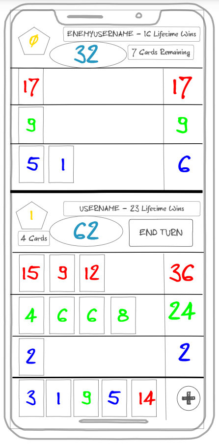

# GWENT
This is intended to be a simplfied version of Gwent, a card mini-game found in the video game Witcher 3.
## Specification Deliverable
### Elevator Pitch
Have you ever wanted to have the convenience of the hit mini game Gwent at your fingertips, without needing to be chained to your desk? This webapp will allow you and a friend to do just that. Simply boot up the website, log in with a friend, and enter the add code. Once thats done, you both can take your turns at this game of strategy wherever you are.
### Design

### Key Features
- Requires Login
- Stores and displays a users lifetime wins
- At the beginning of each game, each player is given random cards of colors and values. Each color can only be placed on the corresponding colored row. The value of each card is added, and shown on the right. The total of all points is shown at the top
- The player can place as many cards as they want on their turn. However, each game is best of three. Blow all your high value cards on round one and you'll likely lose the next round
- Each row and the players hand supports a maximum of six cards. Players automatically draw one card at the start of their turn, and can optionally draw one additional one. Any cards drawn after the player has a full hand is discarded.
- A player has the option to end their turn with no action played. If both players end their turn without playing any card, the round is over. The player with the hightest score of cards wins the round, which is tallied in the top left
### Technologies
- Authentication - Site visitors must log in to access, as well as to match with a second player
- Database - Decks, as well as per-user lifetime score is stored
- WebSocket - Players can see in realtime what the opposing player has played on their field, along with their remaining deck size